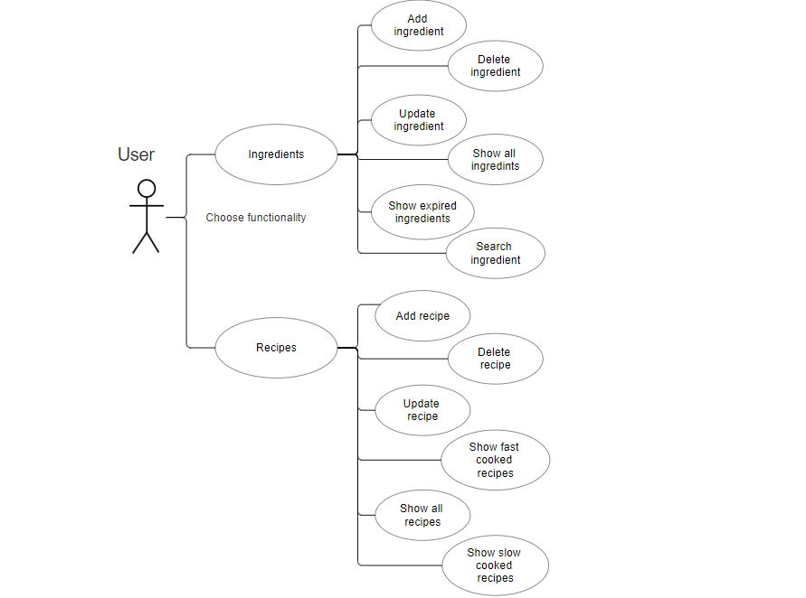

# Cartea de bucate

Această aplicație reprezintă un figider în care adminul poate adăuga diferite alimente. 
The "Cartea de bucate" application serve as your own virtual inteligent fridge. Just like 
your fridge from home you have to fill it with desired or fresh bought ingredients.
Additionally to a normal fridge "Carte de bucate" tells you what recipes you can cook with 
the ingredients inside.

## Features

- Expiration date on every ingredient
- The user is notifyed if an ingredient has gone bad
- A wide range of recipes that you can cook with the items in your fridge
- Subscribers to certain foods get notify when a recepie is ready to be cooked

## Relaltionship between tables

Having just a few relations between tables is what makes this application perfect for 
an introduction for a full stack project.
The user table is missing because every user is on his specific local host. In the future 
the app could be upgraded for a specific user using a log-in method.
-Ingredients to Recipes: Many-to-Many. An ingredient can be found in more than one recipe
and a recipe can have more than one ingredient.

# Implementation

## Backend Development
## HTTP API 
- Application entry point
- Handles HTTP request and lets the appropriate controller to handle them

# Controller
- An intermediary layer between HTTP API and Service
- Validates the incoming requests, and gives commands to the service layer
- Returns responses after the logic execution

# Service
- Contains the logic of the application
- Coordinates the application's operations and manages the flow of data to and from the data layer.

# Contratct
- Performs CRUD operations by comunicating with the database
- Uses JPA Repository to perform all of the operations
- Used to decoup the app

# Model 
- Defines the structures of all the tables in the database

The structure is based of MVC protocol, each layer beeing easy to manage

# CRUD Operations
- Create: New ingredients, new recipes using the ingredients from databse
- Read: Existing ingredients and recipes
- Update: Items are updated when needed
- Delete: Items that are no longer relevant

# API Development
# Ingredients table:
- /ingredients Retrive all ingredients
- /ingredients/{id} Retrive the ingredient with the specific id
- /ingredients/nume/{name} Retrive the ingredient with the specific name
- /ingredients/data/{date} Retrive the ingredient with the specific expiration date
- /ingredients/expired Retrive the ingredients that had gone bad
- /ingredients/{id} Deletes the ingredient with the specific id

# Recipes table:
- /recipes Retrive all recipes
- /recipes/{id} Retrive the recipes with the specific id
- /recipes/fastFood Retrive the recipes with a cooking time lower than 10 minutes
- /recipes/slowFood Retrive the recipes with a cooking time more than 3 hours
- /recipes/{id} Deletes the recipes with the specific id

# Observer design pattern
- Notifications every time there is a change in the database that might interest some of the subscribers

# Unit Testing 
- Unit tests implemented across the layers to ensure functionality and  reliability

# Class diagram 
The class diagram describes the structure of the system,showing the system's classes and the relationship among objects.

# Use case diagram
The use case diagram shows the possible interactions of a user with the system.

## Actors 
- User: Everyone has their own fridge so the user is both the client and the admin of the fridge. It has access to all functionalities

## Use cases 
- Add ingredient: 
   The user can add an ingredient by specifing the name, expiration date and quantity
- Delete ingredient: 
   The user can delete an ingredient that already exists in the database by pressing a button
- Update ingredient: 
   The user can update any of the ingredient atributes
- Show all ingredients: 
   The user can see all of the ingredients from the database
- Show expired ingredients: 
   The user ca see all of the ingredients that are past their expiration date
- Search ingredient: 
   The user can search for an ingredint by typing their name
- Add recipe: 
   The user can add a recipe by specifing the name, ingredients list, date and time for cooking
- Delete recipe: 
   The user can delete a recipe that already exists in the database by pressing a button
- Update recipe: 
   The user can update any of the recipe atributes
- Show all recipes: 
   The user can see all of the recipes from the database
- Show fast cooked recipes: 
   The user can see all of the recipes that can be cooked in less than 10 minutes
- Show slow cooked recipes: 
   The user can see all of the recipes that can be cooked in more than 3 hours

# Front-end documentation

The front-end of the "Cartea de bucate" application is desigend to be an easy to use interface

## Home page
The home page shows the main functionalities of the application at a click of a button.

## Ingredients
The user can view and manage the ingredients 

## Recipes
The user can view and manage the recipes

## Implementation
The front-end of the application is built using the thechnologies:
- JavaScript: To implement the more complex features
- CSS: For styling the web pages
- HTML: For structuring the content and layout of the web pages.

[//]: # (These are reference links used in the body of this note and get stripped out when the markdown processor does its job. There is no need to format nicely because it shouldn't be seen. Thanks SO - http://stackoverflow.com/questions/4823468/store-comments-in-markdown-syntax)

   [dill]: <https://github.com/joemccann/dillinger>
   [git-repo-url]: <https://github.com/joemccann/dillinger.git>
   [john gruber]: <http://daringfireball.net>
   [df1]: <http://daringfireball.net/projects/markdown/>
   [markdown-it]: <https://github.com/markdown-it/markdown-it>
   [Ace Editor]: <http://ace.ajax.org>
   [node.js]: <http://nodejs.org>
   [Twitter Bootstrap]: <http://twitter.github.com/bootstrap/>
   [jQuery]: <http://jquery.com>
   [@tjholowaychuk]: <http://twitter.com/tjholowaychuk>
   [express]: <http://expressjs.com>
   [AngularJS]: <http://angularjs.org>
   [Gulp]: <http://gulpjs.com>

   [PlDb]: <https://github.com/joemccann/dillinger/tree/master/plugins/dropbox/README.md>
   [PlGh]: <https://github.com/joemccann/dillinger/tree/master/plugins/github/README.md>
   [PlGd]: <https://github.com/joemccann/dillinger/tree/master/plugins/googledrive/README.md>
   [PlOd]: <https://github.com/joemccann/dillinger/tree/master/plugins/onedrive/README.md>
   [PlMe]: <https://github.com/joemccann/dillinger/tree/master/plugins/medium/README.md>
   [PlGa]: <https://github.com/RahulHP/dillinger/blob/master/plugins/googleanalytics/README.md>
